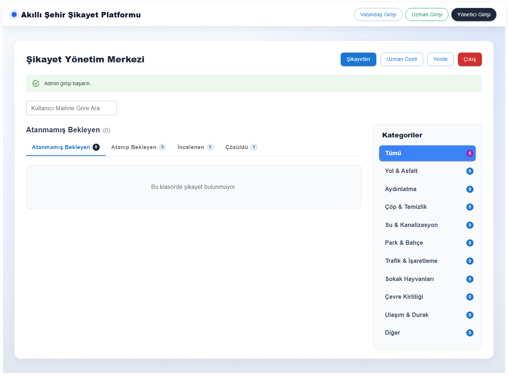
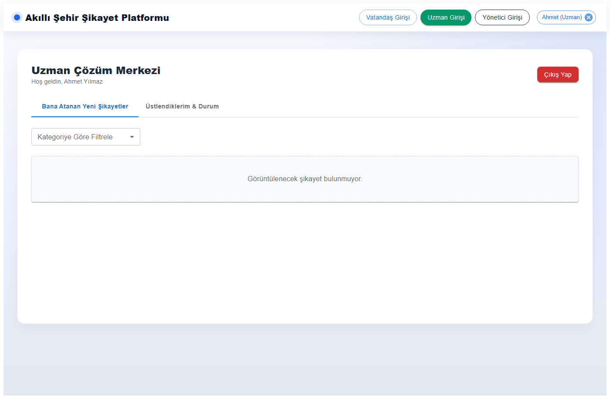

# 🏙️ Akıllı Şehir Şikayet Yönetim Sistemi (Smart City Complaint System)

Bu proje, vatandaşların şehirlerindeki problemleri (yol, aydınlatma, çöp vb.) harita üzerinden konum seçerek veya yapay zeka (NLP) destekli metin analizi ile bildirebildiği; yöneticilerin ve uzmanların bu şikayetleri takip edip çözüme kavuşturabildiği **tam yığın (full-stack)** bir web uygulamasıdır.

## 🌟 Öne Çıkan Özellikler

* **🤖 NLP (Doğal Dil İşleme) ile Otomatik Kategorizasyon:** Vatandaşın girdiği şikayet metni arka planda eğitilmiş bir **Naive Bayes Sınıflandırıcısı** ile analiz edilir ve şikayet otomatik olarak doğru kategoriye (yol, su, çevre vb.) atanır.
* **🗺️ Harita Entegrasyonu:** Leaflet kullanılarak şikayetlerin konumu harita üzerinden seçilebilir ve görüntülenebilir.
* **👥 Çoklu Rol Sistemi (Yetkilendirme):** 
  * **Vatandaş:** Şikayet oluşturur, durumunu takip eder.
  * **Uzman:** Kendi uzmanlık alanına atanan şikayetleri görür, inceler ve çözer.
  * **Admin (Yönetici):** Tüm sistemi izler, istatistikleri görür, manuel atama ve kategori değişiklikleri yapabilir.
* **📊 Dashboard ve Analitik:** Admin panelinde şikayet dağılımı ve çözüm oranları gibi veriler özet halinde sunulur.

## 🛠️ Kullanılan Teknolojiler

**Frontend (Ön Yüz):**
* React.js & Vite
* Material UI (MUI) & Emotion
* React-Leaflet (Haritalandırma)

**Backend (Arka Yüz):**
* Node.js & Express.js
* `natural` kütüphanesi (NLP işlemleri için)
* `multer` (Fotoğraf/Dosya yükleme işlemleri için)

## 🚀 Kurulum ve Çalıştırma

Projeyi kendi bilgisayarınızda çalıştırmak için aşağıdaki adımları izleyin:

### 1. Gereksinimler
Bilgisayarınızda **Node.js**'in yüklü olması gerekmektedir.

### 2. Projeyi İndirin
```bash
git clone https://github.com/senaozkann/smart-city-complaint-system.git
cd smart-city-complaint-system
```

### 3. Backend (Sunucu) Kurulumu
Projenin ana dizininde (root) terminali açın ve bağımlılıkları yükleyip sunucuyu başlatın:
```bash
npm install
npm run server
```
*Backend varsayılan olarak `http://localhost:4000` portunda çalışacaktır.*

### 4. Frontend (Kullanıcı Arayüzü) Kurulumu
Yeni bir terminal penceresi açın ve `frontend` klasörüne girin:
```bash
cd frontend
npm install
npm run dev
```
*Frontend varsayılan olarak `http://localhost:5173` portunda çalışacaktır. Ekranda beliren linke tıklayarak uygulamaya erişebilirsiniz.*

## 📸 Ekran Görüntüleri

| Vatandaş Şikayet Ekranı | Admin Paneli (Bekleyenler) |
|:---:|:---:|
|  |  |

| Uzman Paneli | Şikayet Çözüldü |
|:---:|:---:|
|  |  |

---
*Geliştirici: Sena Özkan*
