# 3. METOT — Programın Çalışma Mantığı

Bu bölümde **Akıllı Şehir Şikayet Platformu**'nun kullanıcı rolleri, ekran akışları ve şikayet yaşam döngüsü açıklanmaktadır. Her alt başlığın altında ilgili arayüz ekran görüntüsü yer alır.

> **Ekran görüntüleri klasörü:** `rapor/ekran-goruntuleri/`

---

## 3.1 Sistem Mimarisi ve Genel Akış

Uygulama **React (Vite)** tabanlı bir ön yüz ve **Node.js / Express** tabanlı bir arka uç sunucusundan oluşur. Veriler `data/complaints.json` ve `data/users.json` dosyalarında saklanır. Şikayetler harita üzerinden konumlandırılır, metin ve fotoğraf ile birlikte kaydedilir; yapay zeka (Naive Bayes) ile kategori tahmini yapılabilir ve ilgili uzmana otomatik yönlendirilir.

**Genel iş akışı:**

1. Vatandaş kayıt olur / giriş yapar  
2. Haritadan konum seçer, şikayetini yazar ve gönderir  
3. Sistem şikayeti kategorize eder ve uzmana atar → durum: **Bekliyor**  
4. Uzman şikayeti inceler → durum: **İnceleniyor**  
5. Sorun giderildiğinde → durum: **Çözüldü**  
6. Yanlış atama durumunda uzman şikayeti admine iade eder; admin doğru uzmana yeniden atar  

---

## 3.2 Ana Ekran ve Giriş Zorunluluğu

Vatandaşlar uygulamayı açtığında karşılarına tanıtım metni, üç adımlı bilgi kartları, interaktif harita ve şikayet formu gelir. Ancak **kayıt olmadan veya giriş yapmadan şikayet gönderilemez.**

- Ana ekranda sarı uyarı kutusu: *"Şikayet göndermek için giriş yapmalısın"*  
- Şikayet formu devre dışıdır; *"Şikayet oluşturmak için önce kullanıcı girişi yapın"* mesajı gösterilir  
- Gönder butonu, token olmadan çalışmaz (hem ön yüz hem arka uç kontrolü)  

**Şekil 3.1 — Ana ekran (giriş yapılmadan şikayet gönderilemez)**

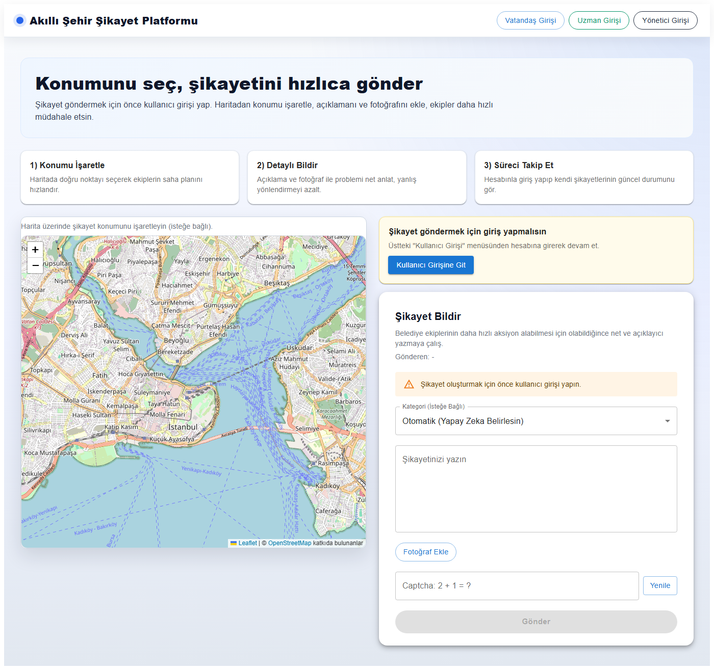

---

## 3.3 Vatandaş Kayıt ve Giriş İşlemleri

Üst menüdeki **"Vatandaş Girişi"** butonuna tıklanarak kayıt veya giriş ekranına geçilir. Kullanıcı e-posta ve şifre ile kayıt olabilir; ardından otomatik olarak giriş yapılır. Giriş yapıldıktan sonra şikayet oluşturma ve takip özellikleri aktif hale gelir.

**Şekil 3.2 — Vatandaş giriş / kayıt ekranı**

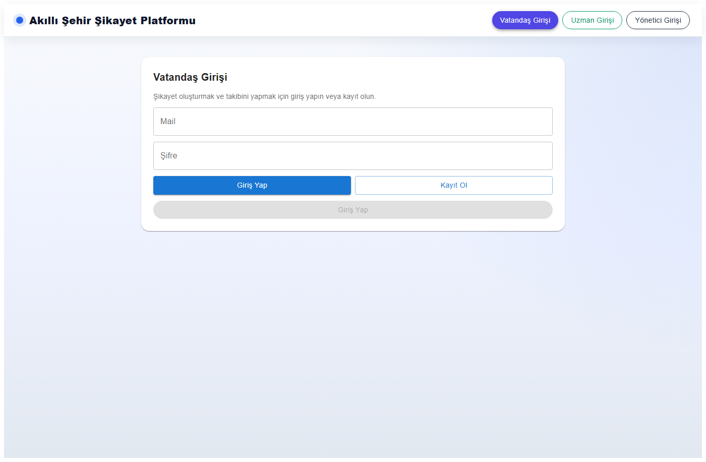

---

## 3.4 Şikayet Oluşturma Ekranı

Giriş yapan vatandaş; haritadan konum seçer, şikayet metnini yazar, isteğe bağlı fotoğraf ekler, kategori seçer (veya yapay zekaya bırakır), captcha doğrular ve **Gönder** butonu ile şikayeti iletir. Gönderim sonrası şikayet **Bekliyor** durumunda sisteme kaydedilir ve kategoriye uygun uzmana otomatik atanır.

**Şekil 3.3 — Giriş yapılmış vatandaş şikayet ekranı**

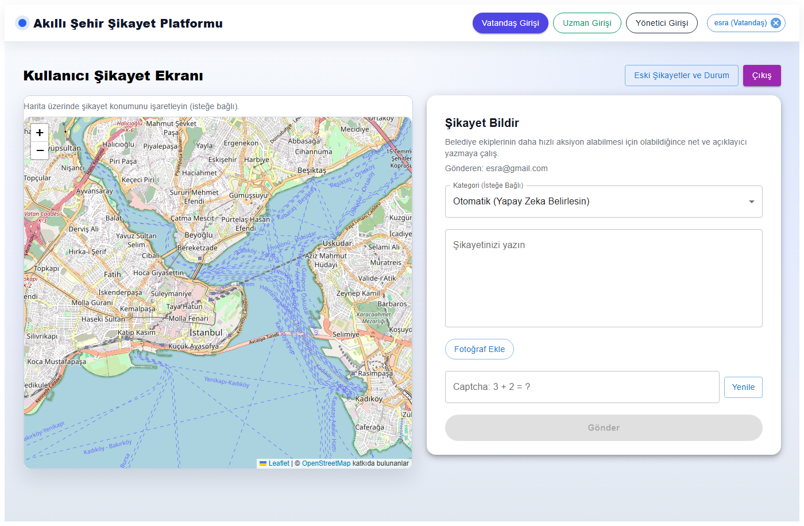

---

## 3.5 Vatandaş Şikayet Takibi

Vatandaş, **"Eski Şikayetler ve Durum"** çekmecesinden kendi şikayetlerini listeleyebilir. Her kayıtta durum (Bekliyor / İnceleniyor / Çözüldü), kategori, atanan uzman ve tarih bilgisi görüntülenir. Duruma göre filtreleme yapılabilir.

**Şekil 3.4 — Vatandaş şikayet geçmişi ve durum takibi**

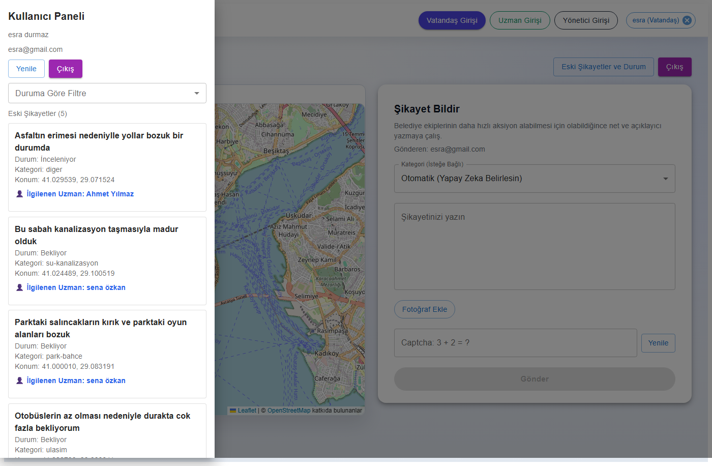

---

## 3.6 Yönetici Girişi

Belediye yöneticileri üst menüdeki **"Yönetici Girişi"** ile ayrı bir kimlik doğrulama ekranına yönlendirilir. Admin hesabı vatandaş/uzman kayıt sisteminden bağımsızdır. Başarılı girişten sonra **Şikayet Yönetim Merkezi** açılır.

**Şekil 3.5 — Yönetici giriş ekranı**

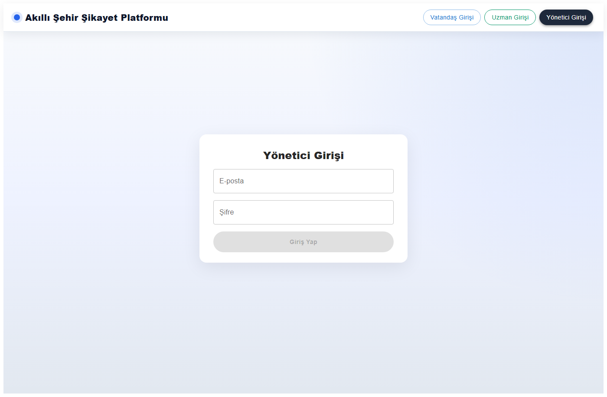

---

## 3.7 Yönetici Paneli — Şikayet Durum Segmentleri

Admin panelinde tüm şikayetler dört ana sekmeye ayrılır:

| Sekme | Açıklama |
|-------|----------|
| **Atanmamış Bekleyen** | Henüz hiçbir uzmana atanmamış, bekleyen şikayetler |
| **Atanıp Bekleyen** | Uzmana atanmış ancak henüz incelenmeye alınmamış şikayetler |
| **İncelenen** | Uzman tarafından üstlenilmiş, çözüm sürecindeki şikayetler |
| **Çözüldü** | Tamamlanmış şikayetler |

Sağ tarafta **Kategoriler** paneli ile şikayetler konu bazında filtrelenebilir (Yol, Aydınlatma, Su & Kanalizasyon vb.). Admin ayrıca kullanıcı e-postasına göre arama yapabilir, kategori ve durum güncelleyebilir, uzman atayabilir.

**Şekil 3.6 — Yönetici paneli genel görünüm**


**Şekil 3.7 — Atanıp bekleyen şikayetler (uzman atanmış, henüz işleme alınmamış)**

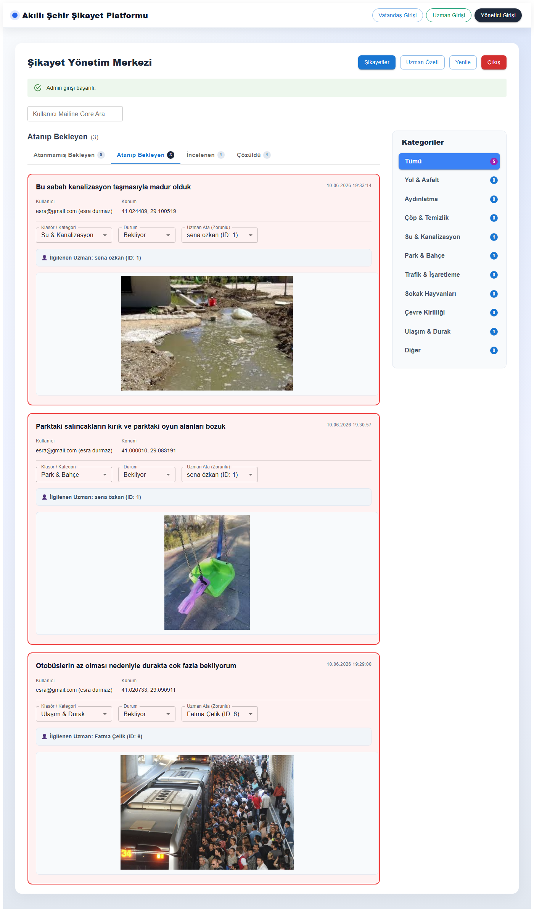

**Şekil 3.8 — İncelenen şikayetler**

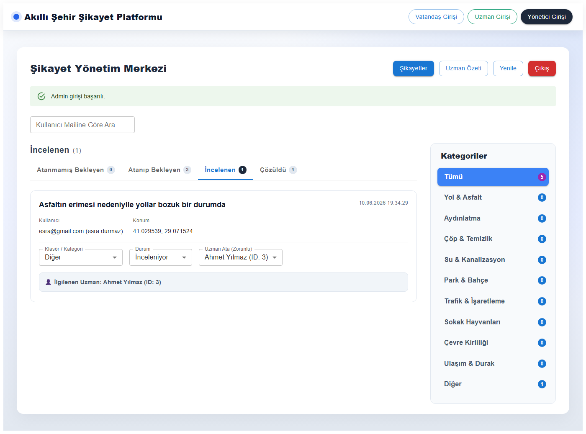

**Şekil 3.9 — Çözülen şikayetler**

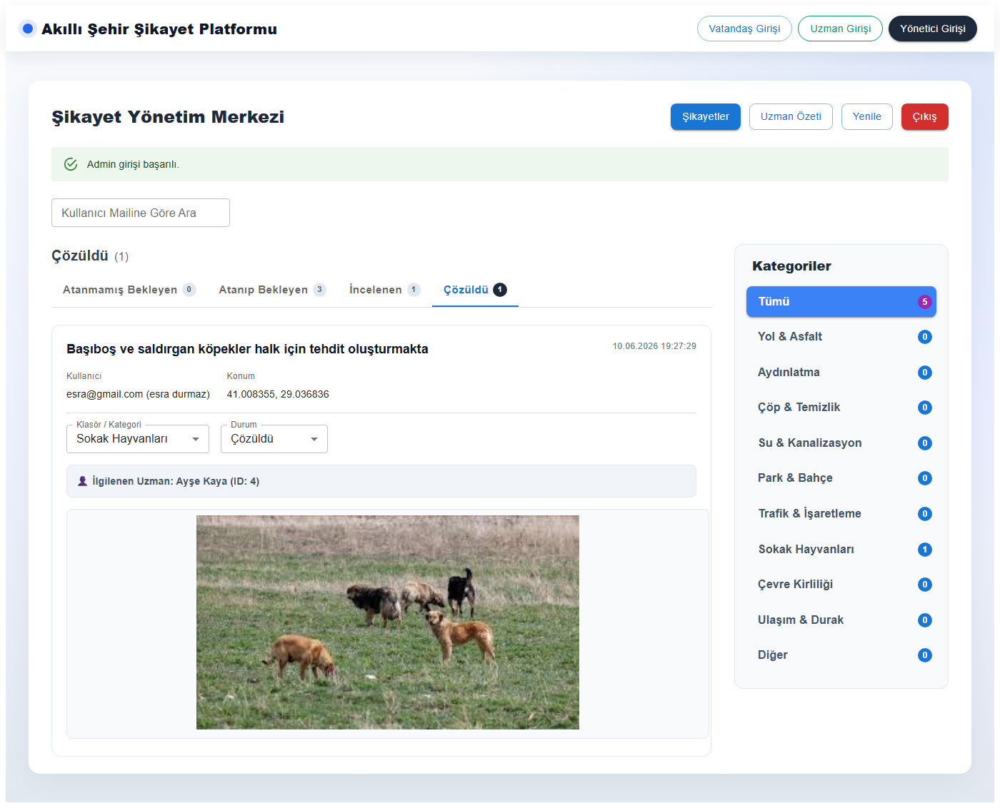

---

## 3.8 Hatalı Atama ve Uzmana Yeniden Yönlendirme

Bir şikayet yanlış uzmana atandığında, uzman panelindeki **"Yanlış Uzman / Admine Gönder"** butonu ile şikayet yöneticiye iade edilir. Bu işlem sonrasında:

- Şikayetin durumu tekrar **Bekliyor** olur  
- Mevcut uzman ataması kaldırılır  
- Admin panelinde kırmızı **"Hatalı Atama"** uyarısı görünür  
- Admin, **"Uzman Ata (Zorunlu)"** alanından doğru uzmanı seçerek şikayeti yeniden yönlendirir  

Bu mekanizma, şikayetlerin doğru birimlere ulaşmasını ve yanlış yönlendirmelerin hızla düzeltilmesini sağlar.

> **Not:** Hatalı atama uyarısı, uzman iade işlemi gerçekleştiğinde admin panelinde görünür. Rapor ekran görüntüsü için uzman panelindeki iade butonu Şekil 3.12'de gösterilmiştir.

---

## 3.9 Uzman Girişi ve Çözüm Merkezi

Uzmanlar (belediye teknik personeli) **"Uzman Girişi"** menüsünden sisteme girer. Uzman hesapları önceden tanımlıdır; vatandaş gibi kayıt olma seçeneği yoktur. Giriş sonrası **Uzman Çözüm Merkezi** açılır.

**Şekil 3.10 — Uzman giriş ekranı**

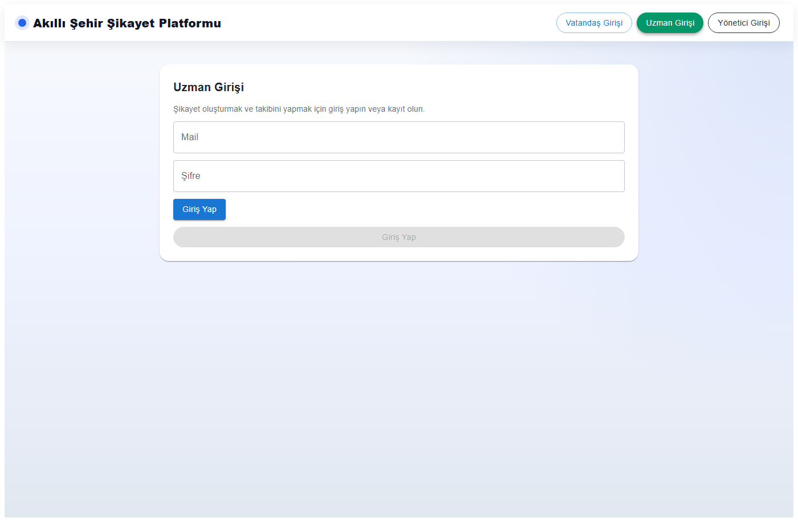

---

## 3.10 Uzman Paneli — Atanan Şikayetler ve Durum Yönetimi

Uzman paneli iki ana sekmeye ayrılır:

### Bana Atanan Yeni Şikayetler
Admin veya sistem tarafından otomatik atanan, henüz **Bekliyor** durumundaki şikayetler burada listelenir. Uzman:
- **İncelemeye Al / Üstlen** → durumu **İnceleniyor** yapar  
- **Yanlış Uzman / Admine Gönder** → şikayeti admine iade eder  

### Üstlendiklerim & Durum
Uzmanın üstlendiği veya çözüme kavuşturduğu şikayetler burada görünür. Uzman:
- **Çözüldü Olarak İşaretle** → durumu **Çözüldü** yapar  
- Gerekirse tekrar admine iade edebilir  

Kategoriye göre filtreleme ile uzman yalnızca kendi alanındaki şikayetlere odaklanabilir. 48 saati geçen bekleyen şikayetlerde gecikme uyarısı gösterilir.

**Şekil 3.11 — Uzman paneli (kendisine atanan yeni şikayetler)**

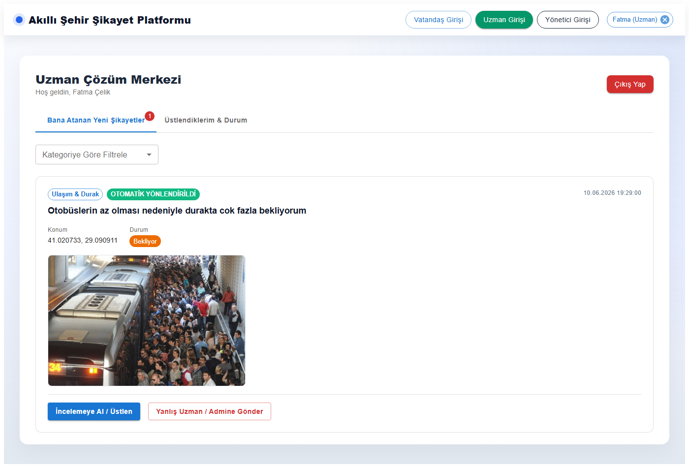

**Şekil 3.12 — Uzman paneli (üstlendiği şikayetler ve durumları)**

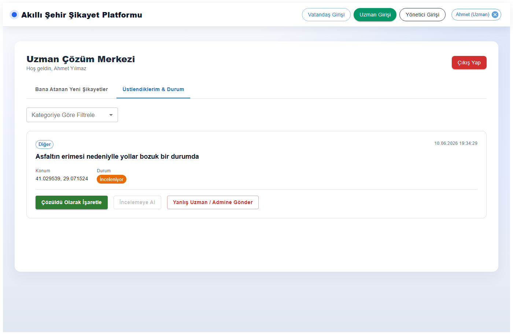

---

## 3.11 Şikayet Durum Diyagramı

```
[Vatandaş şikayet gönderir]
         │
         ▼
    ┌─────────┐
    │ Bekliyor │ ◄── Uzman "Yanlış Uzman" ile iade ederse
    └────┬────┘
         │ Uzman "İncelemeye Al" veya Admin durumu günceller
         ▼
   ┌────────────┐
   │ İnceleniyor │
   └──────┬─────┘
          │ Uzman veya Admin "Çözüldü" işaretler
          ▼
     ┌─────────┐
     │ Çözüldü  │
     └─────────┘
```

---

## 3.12 Özet Tablo — Rol Bazlı Yetkiler

| Özellik | Vatandaş | Uzman | Admin |
|---------|----------|-------|-------|
| Kayıt olma | ✓ | ✗ (önceden tanımlı) | ✗ (ayrı giriş) |
| Şikayet gönderme | ✓ (giriş zorunlu) | ✗ | ✗ |
| Kendi şikayetlerini görme | ✓ | ✗ | ✗ |
| Atanan şikayetleri görme | ✗ | ✓ | ✓ (tümü) |
| Durum güncelleme | ✗ | ✓ (atananlar) | ✓ (tümü) |
| Uzman atama | ✗ | ✗ | ✓ |
| Hatalı atamayı iade | ✗ | ✓ | — (yeniden atar) |
| Kategori düzeltme | ✗ | ✗ | ✓ |

---

*Bu metin raporunuzun Metot bölümüne doğrudan kopyalanabilir. Word'e aktarırken `ekran-goruntuleri` klasöründeki PNG dosyalarını ilgili Şekil numaralarının altına eklemeniz yeterlidir.*
